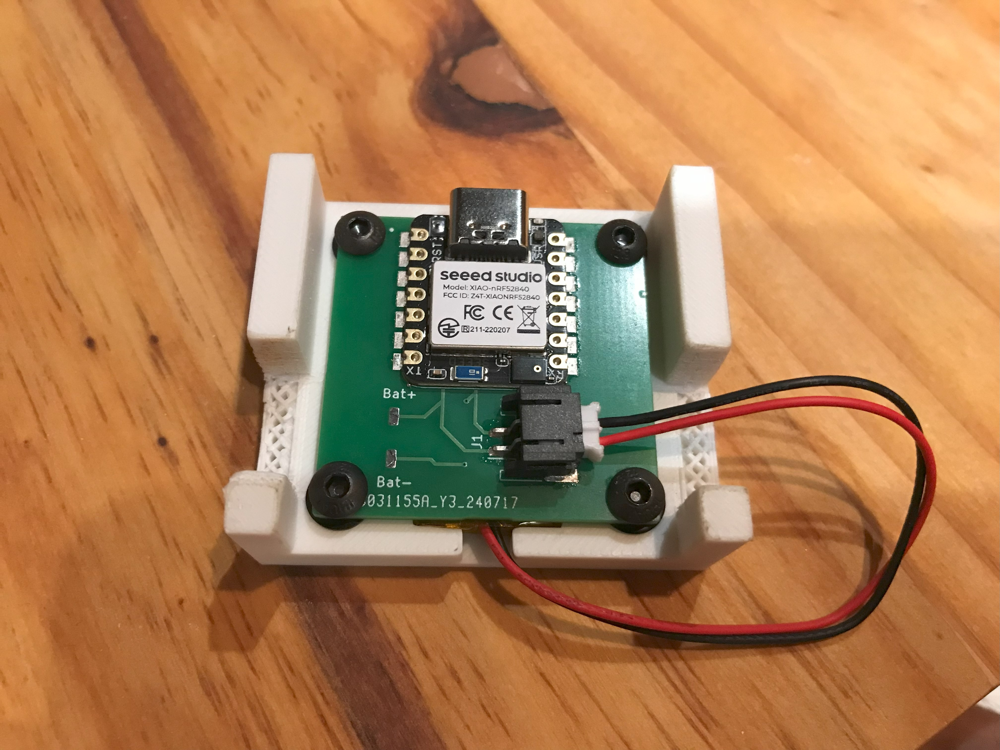
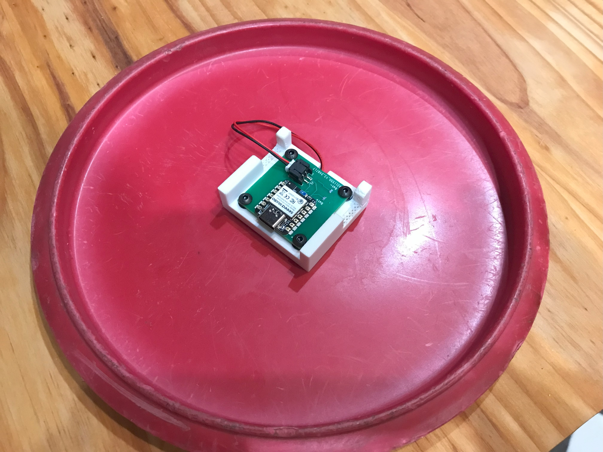

# OpenDataDisc

An open platform that allows disc golfers to collect their throw statistics.

> Your throw, your data, your platform.

## Pics

> Putter Dev Board

> Putter Board Mounted On Disc

I'm documentating my process over on my [youtube channel](https://www.youtube.com/@BlenderDiscGolf).

## Disc Golf + Analytics

I'd love the ablity to track and measure my disc golf throws without spending tons of money.

* Would it be easier to buy one of the currently available products? Probably.
* What's the likelihood this project never completes its goal? Higher than 0.

So why I am doing it? I'm a sucker for starting something new, I'm a software developer, have started playing disc golf and wanted a project to combine those 2.

Will that mix actually produce something usable? No idea.

## Current Project Phase

Phase: Putter version

As shown in the pics above, I have a putter dev board that I'm just starting to use to measure statistics of putts.

Putts are easier to measure due to low speeds and rpms.

## Project Phases (Somewhat flexible now)

* Getting to know hardware
  * Buying the hardware I think I need.
  * Hooking everything up.
  * Getting data flowing between microcontroller and computer.
  * Getting some basic calculations working
* Putter version (current phase)
  * Putts have slow RPMs and low Gs
    * These values are much easier to measure and test.
    * Hardware is also cheaper.
    * Will probably be using as many off the shelf parts as possible. (Nothing really custom designed)
  * Create a developer kit that can be used for putters.
    * Not something that would probably be widely available, but might create some dev kits for technical people wanting to help.
  * Need some hardware to confirm the sensor values.
    * Speed gun, high speed camera, etc
  * Most R&D on this project will be based on this platform.
* Alpha Driver Disc
  * To develop something to track high speed throws, will probably need:
    * Custom hardware
    * Beefed up software
    * More expensive testing equipment
* Beta Driver Disc
  * Create a more refined alpha setup
  * Any problems I encountered in the Alpha disc can be changed here
* Driver Disc
  * First proper product release
  * Should be easy for non technical people to setup and use
  * Lots of polish will need to happen before this is ready

## Repo Layout

This repo holds both [hardware](./hardware/README.md) and [software](./software/README.md) for the OpenDataDisc project. As this project is still in it's early phase, there's no instructions on how to build your own and run on your own computers. 

That information will come as the project progresses.