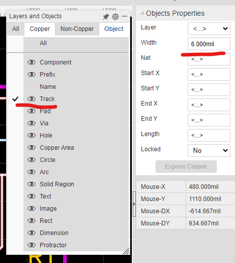

# Breakout Board for ADXL313

To up my sensors for my potential disc, I wanted to create a breakout board for the [ADXL313](https://www.mouser.com/ProductDetail/Analog-Devices/ADXL313WACPZ-RL7?qs=hpwIUhX6lWxhablde0IbcQ%3D%3D).

I really want to use a ADXL314 in my board, but there's not much documentation for that. So I am trying to start with the 313, see if I can use that correctly. Then move onto the 314.

Links:
* [Sparkfun Schematic](https://cdn.sparkfun.com/assets/9/b/0/1/5/SparkFun_Qwiic_ADXL313.pdf)
* [Mouser Part](https://www.mouser.com/ProductDetail/Analog-Devices/ADXL313WACPZ-RL7?qs=hpwIUhX6lWxhablde0IbcQ%3D%3D)
* [AD Datasheet](https://www.mouser.com/datasheet/2/609/ADXL313-1503823.pdf)

PCB Process
* Place Header Pins
  * Ensure 700 Mil across
* Place things on edges
* Create 2 new Planes
  * Tools > Layer Manager
  * Cooper Layout Dropdown (change from 2 to 4)
  * The 2 new inner layers, change from Signal to Plane
  * Click Setting to apply
  * Make first new inner Plane visible
    * Select it
    * Change text to 3.3V to indicate power
  * Make second new inner plane visible
    * Select it
    * Ensure it's called GND
* Change plane color for 2 new planes
  * Tools > Net Color
  * Select 3.3V (or power plane) => #FF6600
  * Select GND => #0066FF
* Connect all wires as expected
* Use standard impedence of 6 mils
  * 50 ohms
  * Only show tracks
  * Select all tracks
  * Change width to 6 mil:

  * Change width of power and ground pins to 21 mils (potentially smaller when no space)
    * Potentially 12 mils when no space
  * Check drc errors
* Add text if you desire

Ordering PCB
* Go to JLCPCB
* Select instant quote
* Upload Gerber files
* Change Sureface Finish to be LeadFree HASL or ENIG
* Turn on Impedence Control
  * The 3313 option
* My option doesn't have Layer Control
* Choose to generate stencil if you need it
* If choosing PCB manufacturer, go back to Easy EDA, generate BOM and Pick and Play