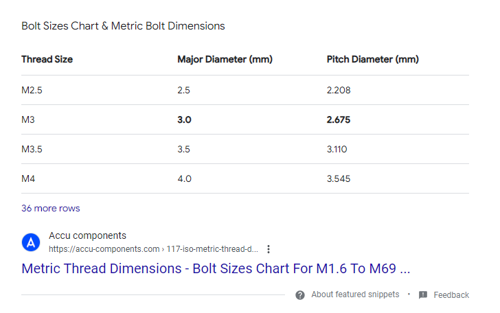

# NRF52 Sense PCB Design

After watching [this youtube video](https://www.youtube.com/watch?v=2vHB8AUQKWM), it made the point that if I am not planning on using Wifi, the esp32 is a bit overkill. I can reduce my power/battery requirements by picking another board.

So I landed on the NRF52 microcontroller. I specifically have bought a [Seeed Studio XIAO nRF52840 (Sense)](https://wiki.seeedstudio.com/XIAO_BLE/).

This experiment is an attempt to design a PCB that I can attach the dev board to, to one day put it on a disc.

Using a M3 mouting hole on the PCB. Based on Reddit below.

M3 screws have a Major Diameter of 3.0 mm, I made the mounting holes on my PCB 3.1 mm.

## Resources

* Mounting hole diameter - https://www.reddit.com/r/AskElectronics/comments/uet1u9/comment/i6qwwx0/?utm_source=share&utm_medium=web3x&utm_name=web3xcss&utm_term=1&utm_content=share_button
* Generating Gerber Files from Kica - https://www.pcbway.com/helpcenter/technical_support/Generate_Gerber_file_from_Kicad.html