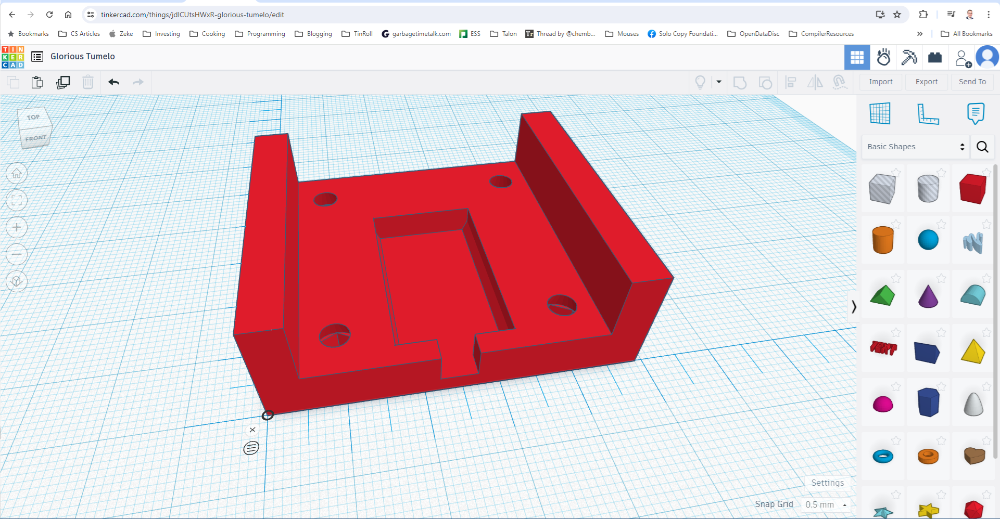

# Putter Housing (3d Print)

After creating the PCB in example 1, I needed a housing to assemble everything together.

## Tinkercad Design

I have designed the following 3d printed housing:

Tinkercad link: https://www.tinkercad.com/things/eYMJKqX6BG7-incredible-lappi/edit?sharecode=7NKQhyTiIKpr6THV6m0gkllo15M5Iyryj7eEoSxFi5s

It has 4 screw holes to attach the PCB, a well for the battery and 2 spacers to ensure nothing damages the circuit board.

The 3d design is contained in the [Putter Housing v2.zip](./Putter%20Housing%20v2.zip) file for anyone interested in making their own.

## Resources

* Metric Nut Dimensions - https://amesweb.info/Fasteners/Nut/Metric-Hex-Nut-Sizes-Dimensions-Chart.aspx
* M3 screw kit I bought - https://www.amazon.com/gp/product/B0C8HV5C3N/ref=ppx_yo_dt_b_asin_title_o00_s00?ie=UTF8&psc=1