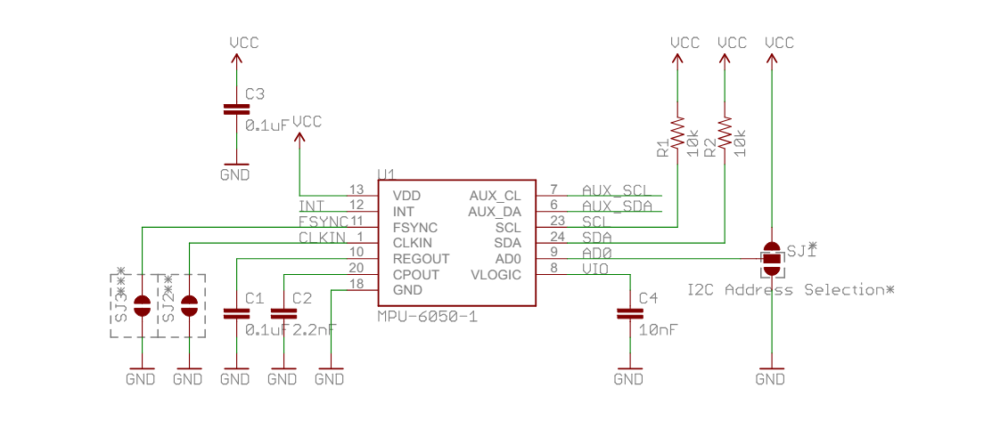
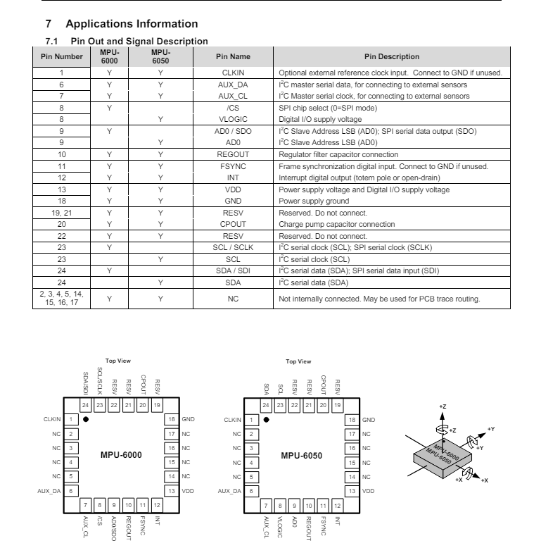

# Notes on the MPU 6050

Part of this project is trying to understand what the electronics are doing. At some point I'll probably want to create something custom (circuit board, etc), I need to understand the underlying electronics.

Questions:
* How does a breakout board allow easier access to the mpu 6050?
* What is the raw mpu 6050 output?
  * How do analog-to-digital converters make interfacing with the mpu 6050 easier?
* How do analog-to-digital converters digitize the gyroscope and accelerometer outputs?
  * The MPU-60X0 features three 16-bit analog-to-digital converters (ADCs) for digitizing the gyroscope outputs and three 16-bit ADCs for digitizing the accelerometer outputs. 
  * [section 3.1 of source](https://invensense.tdk.com/wp-content/uploads/2015/02/MPU-6000-Datasheet1.pdf)
* Exploring a [breakout board](https://dlnmh9ip6v2uc.cloudfront.net/datasheets/Sensors/IMU/MPU-6050_Breakout%20V11.pdf), what do the following values mean?
  
  * VDD
  * INT
  * FSYNC
  * CLKIN
  * REGOUT
  * CPOUT
  * GND
  * AUX_SCL
  * AUX_SDA
  * SCL
  * SDA
  * AD0
  * VLOGIC - Digital I/O supply voltage
    * VLOGIC reference pin is used to set the logic levels of the I2C interface. [ref](https://www.elprocus.com/mpu6050-pin-diagram-circuit-and-applications/#:~:text=VLOGIC%20reference%20pin%20is%20used,levels%20of%20the%20I2C%20interface.)
* How can I communicate with the device through registers?
  * "Communication with all registers of the device is performed using either I2C at 400kHz or SPI at 1MHz (MPU-6000 only)." [datasheet](https://invensense.tdk.com/wp-content/uploads/2015/02/MPU-6000-Datasheet1.pdf)
* How to interface with an I2C serial port?
* [Data sheet](https://invensense.tdk.com/wp-content/uploads/2015/02/MPU-6000-Datasheet1.pdf) contains the following information:

* A reference to a mpu6050 [breakout board design](https://electronics.stackexchange.com/questions/438719/checking-my-mpu6050-schematic)
* What is the I2C protocol?
* How can I build my own analog-to-digital converters? (16 ADC)