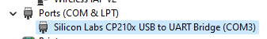

# Getting Started with Esp32

I bought this microcontroller: https://www.mouser.com/ProductDetail/Espressif-Systems/ESP32-S3-DevKitM-1-N8?qs=XAiT9M5g4x%2F0QWl%252BQomf2w%3D%3D

> ESP32-S3-DevKitC-1-N8 - WiFi Development Tools - 802.11 ESP32-S3 General-Purpose Development Board, ESP32-S3-WROOM-1-N8, with Pin Header

I had the following problems in getting a blink example working:

* Needed to install esp32 for arduino IDE
  * I googled for how to do this
* Figured out which board to select in the Arduino IDE
  * Went with "ESP32S3 Dev Module"
* Figure out which port to use
  * This microcontroller comes with 2 usb ports (labeled UART and USB).
  * Did some googling, it seems like the UART port is more the debugging one. The USB port is more for mimicing a USB device, if you were trying to do that.
  * So using UART port.
* I needed to use a good usb cable
  * Some usb cables only do power, some do data and power.
  * I was using one, my computer wouldn't recognize it, I tried a better one and my port popped right up.
* Then I needed to download the driver for USB to UART bridge
  * Windows wouldn't automatically recognize my esp32, and wouldn't download the driver automatically.
  * After googling I found a driver on Silicon Labs website. I choose the "Windows Driver" instead of the "Universal Windows Driver"
* Then finally got it to recognize my microcontroller:

  * Previously it was under the "Other devices" category and had an error saying it couldn't find the driver
* Now I can upload the Arduino IDE builtin Blink sketch (located at File > Examples > 01.Basic > Blink) and run on the esp32!

First example down, now on to an accelerometer!