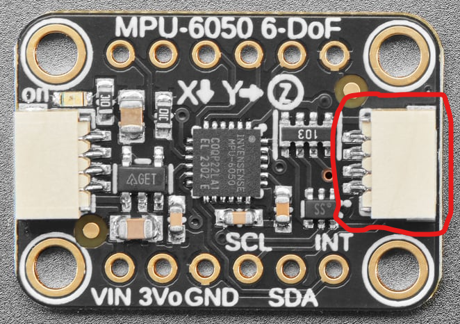
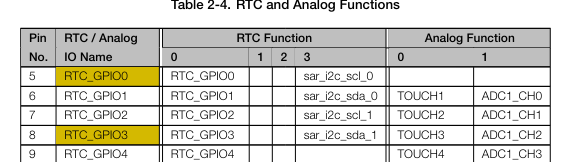
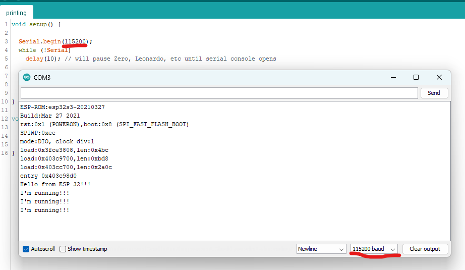
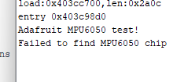

# Getting an Accelerometer Working

Now that I've got a blink sketch down, I want to use my accelerometer to get back some real data.

For reference I am using the following components:

* A esp32 microcontroller (ESP32-S3-DevKitC-1-N8)
  * https://www.mouser.com/ProductDetail/Espressif-Systems/ESP32-S3-DevKitC-1-N8?qs=sGAEpiMZZMuqBwn8WqcFUipNgoezRlc4bGSrPQu5tzyJnBQGtrSXSw%3D%3D
* An accelerometer (Adafruit MPU-6050 6-DoF Accel and Gyro Sensor - STEMMA QT Qwiic)
  * https://www.mouser.com/ProductDetail/Adafruit/3886?qs=xZ%2FP%252Ba9zWqYWl0i8uQS6xQ%3D%3D
* A cable to connect the two (STEMMA QT / Qwiic JST SH 4-pin to Premium Male Headers Cable - 150mm Long)
  * https://www.mouser.com/ProductDetail/Adafruit/4209?qs=PzGy0jfpSMvCXPIwCvMoFg%3D%3D

## Installing Libraries

I had to install the following libraries into my Arduino IDE to get this working:

* Adafruit MPU6050
* Adafruit BusIO
* Adafruit Unified Sensor

## Hooking Everything Up

I have the ESP 32 already on my breadboard.

The accelerometer has 2 Qwiic connectors on it, I'm plugging mine into the right side one:



Then connecting the following leads into the following ports on my microcontroller:

I followed [this tutorial](https://randomnerdtutorials.com/esp32-mpu-6050-accelerometer-gyroscope-arduino/) matching the header pins from [this documentation](https://docs.espressif.com/projects/esp-idf/en/latest/esp32s3/hw-reference/esp32s3/user-guide-devkitc-1.html) to hook it up.

* Blue (SDA) => # 6 on board
* Yellow (SCL) => # 5 on board
* Black (Ground) => G
* Red (Power) => 3V3

### Finding the right ports

The tutorial about from randomnerdtutorials has a board where the SDA and SCL default pins are 21 and 22. Looking up the documentation for my board, it's 5 & 6:



## Issues I encountered

I had several issues I encountered while doing this project:

* Which pins to hook the accelerometer up to.
  * The example I was following used pins 21 & 22.
  * I didn't have pin 22.
  * So I referenced the esp32 documentation (screenshot above), and choose 5 & 6.
* Wrong baud rate for the serial monitor.
  * This sketch prints sensor measurements back to my computer.
  * When you open the serial monitor in Arduino IDE, you have to match the baud rate in code.
  * The following rates need to match:

  * No matching, no messages
* When I uploaded my sketch, I got the following error:
  * "Failed to find MPU 6050 chip"

  * `Failed to find MPU6050 chip`
  * I had to tell the Adafruit library which pin I was using.
  * This was accomplished by the following line of code `Wire.begin(6, 5);`, see sketch for reference.

Once I fixed all those things, everything worked.

## Expected Output

Here is some of my output once I got this example running:


### Boot up Logging
```
ESP-ROM:esp32s3-20210327
Build:Mar 27 2021
rst:0x1 (POWERON),boot:0x8 (SPI_FAST_FLASH_BOOT)
SPIWP:0xee
mode:DIO, clock div:1
load:0x3fce3808,len:0x4bc
load:0x403c9700,len:0xbd8
load:0x403cc700,len:0x2a0c
entry 0x403c98d0
Adafruit MPU6050 test!
MPU6050 Found!
Accelerometer range set to: +-8G
Gyro range set to: +- 500 deg/s
Filter bandwidth set to: 5 Hz
```

### Flat Measurement

Z should reflect pushing against gravity, so 9.8m/s^2, but as you can see this sensor needs some calibration.

It's also reading 33.88 degC, which is 91.4 degF. My house is currently 76-78 degF. So that also needs some work.
```
Acceleration X: 0.61, Y: 0.14, Z: 7.55 m/s^2
Rotation X: -0.04, Y: 0.01, Z: -0.02 rad/s
Temperature: 33.88 degC
```

### 90 degree X Rotation

Rotated in the X direction, so X should reflect G, but notice how it's pretty far off.
```
Acceleration X: 10.19, Y: 0.16, Z: -3.06 m/s^2
Rotation X: -0.04, Y: 0.00, Z: -0.01 rad/s
Temperature: 35.86 degC
```

## Outro

I have some raw sensor data, as you can see, not very accurate at this point. But it's a step in the right direction.