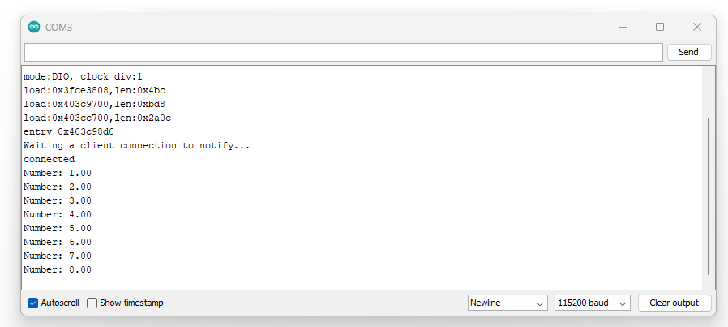
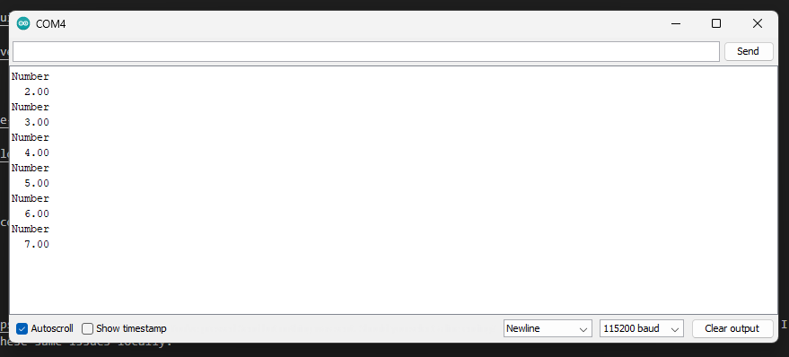

# Bluetooth 03 Project

This project allows bluetooth connections between 2 ESP32.

> I attempted to get my ESP32 communicating with my windows PC, but haven't been able to achieve that yet.

I'm following [this tutorial](https://randomnerdtutorials.com/esp32-ble-server-client/), modified a bit because I don't have a temperature/humidity sensor, and I don't have an OLED screen.

## Project Breakdown

For modern bluetooth, Bluetooth Low Energy (BLE), a connection is made between a Client and a Server. (Bluetooth Classic is different, but I won't get into that here).

For this example, the server publishes data to the client.

For this example, I'm using the following ESP32s:

* Server: [ESP32-S3-DevKitC-1-N8](https://www.mouser.com/ProductDetail/Espressif-Systems/ESP32-S3-DevKitC-1-N8?qs=sGAEpiMZZMuqBwn8WqcFUipNgoezRlc4bGSrPQu5tzyJnBQGtrSXSw%3D%3D)
* Client: [Adafruit QT Py ESP32 Pico](https://www.mouser.com/ProductDetail/Adafruit/5395?qs=mELouGlnn3fl2ssvoUTVkw%3D%3D)

As long as you have 2 Esp32 boards both running BLE, you should be fine.

### Running 2 Esp Boards At Once

I'm using 2 Esp boards, both using the Arduino IDE. I had to running two separate instances of the Arduino IDE. And my Server was running on Com3 and my Client was running on Com4.

I didn't have any issues getting both working together.

## Server Code

The server starts up, and waits for a connection to be made to it.

It advertises both a service and a characteristic, identified by UUIDs.

## Client Code

The clients starts up, looks for the Server, tries to connect to it referencing both the UUIDs of the service and characteristic.

## Running & Message Passing

Once they're connected, the Server begins notifying the Client of a number (could be anything).

That looks something like this.

Server: 

Client: 

