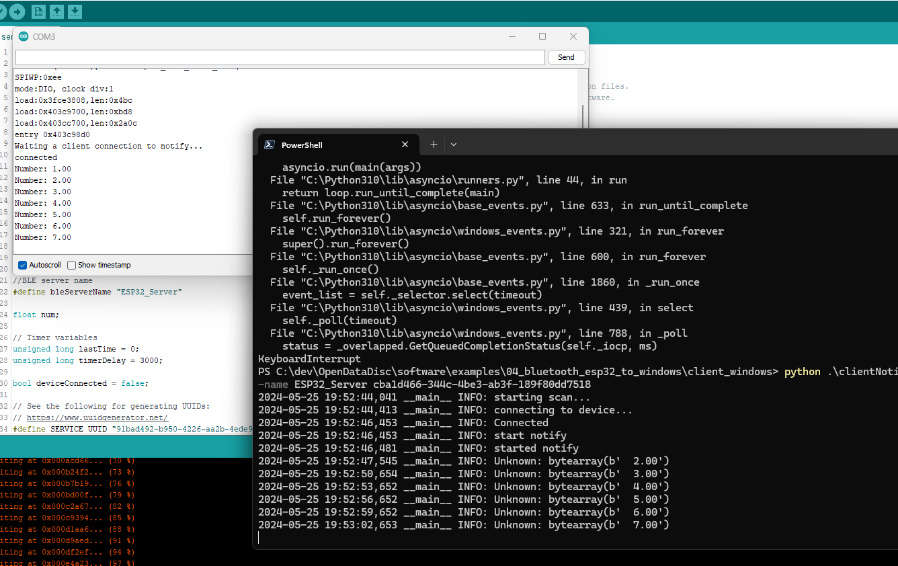

# Esp32 to Windows Bluetooth Example

This project documents my attempt to push data from the Esp32 to my windows laptop.

## Client

In this example, I'm using [bleak](https://github.com/hbldh/bleak), a cross platform python ble library.

The [client_windows](/software/examples/04_bluetooth_esp32_to_windows/client_windows/) folder has several examples of working clients.

> The [clientNotifications.py](/software/examples/04_bluetooth_esp32_to_windows/client_windows/clientNotifications.py) was the final version that worked the best.

## ESP 32

This is using very similar code to [example 03](../03_bluetooth_esp32_to_esp32/), modified a bit as issues arose.

## Life!!!

We have communication!! I'm able to push integer values from my ESP 32 to my windows client and log them.

## Issues

* Disconnect not working as expected:
  * https://github.com/hbldh/bleak/pull/974
  * https://github.com/hbldh/bleak/issues/807
  * Apparently this is a known issue in bleak. Bleak informs Windows OS to disconnect, and it never tells the bluetooth device it's been disconnectd.
  * Leading to a bad state where the ESP32 is pushing data to a disconnected client, this also prevents reconnection since ESP32 thinks it's still connected.
  * Bleak docs: https://bleak.readthedocs.io/en/latest/api/client.html