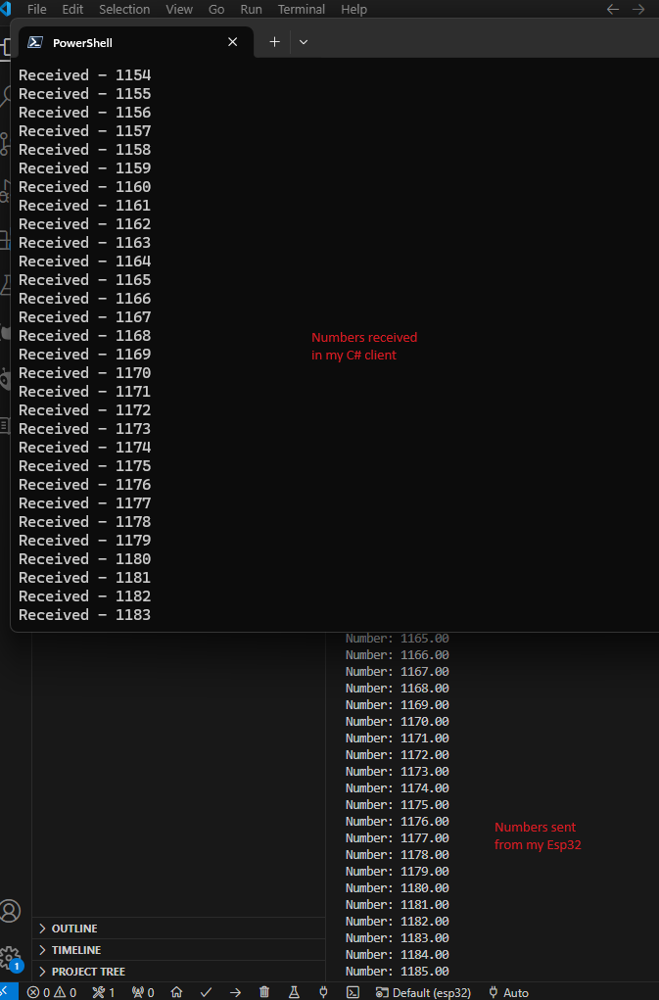

# Bluetooth with a CSharp Client

I know in my last experiment, I said I was fine with using bleak and python for my client code.

But I changed my mind. I'm a C# developer professionally. If this does end up going somewhere I think C# has more options for deploying to more places (specifically mobile apps) than python does.

So I'm going to see how hard it is to make a C# bluetooth client to receive messages from my esp32.

## Esp32

Basically the same exact setup, see past examples for how I did this.

## CSharp Client

For this, 

* Downloaded a 8.0 version of .NET SDK
* Created a simple hello-world console application.
* Installed the [nuget library](https://www.nuget.org/packages/InTheHand.BluetoothLE)
* Opened in Visual Studio Code
* Ran the following commands to build and run this application from the directory containing `OpenDataDisc.csproj`
  * `dotnet build`
  * `dotnet run`
  * If you're using powershell, you can combine them into one command like `dotnet build; dotnet run`
* Debugged the below issue
* Went through the debugging cycle a bit.
  * Read through the 32Feet documentation
  * Learned about Event Handlers
* Finally was able to read numbers in my windows client from my esp32.

* Best of all, I can connect and disconnect from my esp32 as expected.
  * I don't have to unplug it, or reset anything. Everything seems to be working smoothly.

### Runtime Issues

I ran into the following issue when first building this project:

```
Unhandled exception. Tmds.DBus.ConnectException: No path specified for UNIX transport
 ---> System.ArgumentException: No path specified for UNIX transport
   at Tmds.DBus.AddressEntry.ResolveAsync(Boolean listen)
   at Tmds.DBus.Transports.TransportSocket.ConnectUnixAsync(AddressEntry entry, CancellationToken cancellationToken, Boolean supportsFdPassing)
   at Tmds.DBus.Transports.Transport.ConnectAsync(AddressEntry entry, ClientSetupResult connectionContext, CancellationToken cancellationToken)
   at Tmds.DBus.DBusConnection.ConnectAsync(ClientSetupResult connectionContext, Boolean runContinuationsAsynchronously, Action`1 onDisconnect, CancellationToken cancellationToken)
   at Tmds.DBus.Connection.DoConnectAsync()
   --- End of inner exception stack trace ---
   at Tmds.DBus.Connection.DoConnectAsync()
   at Tmds.DBus.Connection.CallMethodAsync(Message message)
   at Tmds.DBus.CodeGen.DBusObjectProxy.SendMethodReturnReaderAsync(String iface, String member, Nullable`1 inSignature, MessageWriter writer)
   at Tmds.DBus.CodeGen.DBusObjectProxy.CallNonVoidMethodAsync[T](String iface, String member, Nullable`1 inSignature, MessageWriter writer, ReadMethodDelegate`1 readValue)
   at Linux.Bluetooth.BlueZManager.GetProxiesAsync[T](String interfaceName, IDBusObject rootObject)
   at Linux.Bluetooth.BlueZManager.GetAdaptersAsync()
   at InTheHand.Bluetooth.Bluetooth.Initialize()
   at InTheHand.Bluetooth.Bluetooth.PlatformGetPairedDevices()
   at Program.<Main>$(String[] args) in C:\dev\OpenDataDisc\software\examples\07_csharp_bluetooth\client_windows\OpenDataDisc\Program.cs:line 5
   at Program.<Main>(String[] args)
```

This [github issue](https://github.com/inthehand/32feet/issues/341) provided some tips. Specifying .net7 isn't viable anymore, since it's out of support.

So I updated my csproj file to the following:

```xml
<Project Sdk="Microsoft.NET.Sdk">

  <PropertyGroup>
    <OutputType>Exe</OutputType>
    <TargetFramework>net8.0-windows10.0.22621.0</TargetFramework>
    <ImplicitUsings>enable</ImplicitUsings>
    <Nullable>enable</Nullable>
  </PropertyGroup>

  <ItemGroup>
    <PackageReference Include="InTheHand.BluetoothLE" Version="4.0.36" />
  </ItemGroup>

</Project>
```

I believe `<TargetFramework>net8.0-windows10.0.22621.0</TargetFramework>` was the crucial piece. Even though I'm running Windows 11.