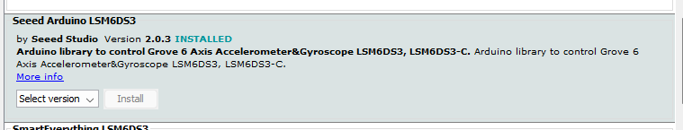

# The NRF52 IMU

Now that we've got the blink working on the nrf52 Sense. I want to start working on using the accelerometer/gyro.

## What I Did

* Install SEEED Boards
  * Follow instructions on their wiki
  * https://wiki.seeedstudio.com/XIAO_BLE/#hardware-setup
* Install the LSM6DS3 arduino library
  * In Arduino IDE
  * Tools > Manage Libraries > Search for "LSM6DS3"
  * Install the following library:

* Use the code provided in this example
* Upload to board
* Open serial plotter, ensure Baud rate is 115200 (matching what is in the `setup()` method)
* Should see printout of accelerometer values
## Issues

## Resources

* Forum Post - https://forum.seeedstudio.com/t/seeed-xiao-ble-nrf52840-sense-giving-bad-gyroscope-data/274134
* SparkFun Documentation - https://learn.sparkfun.com/tutorials/lsm6ds3-breakout-hookup-guide/all#installing-the-arduino-library
* Sparkfun Github Repo - https://github.com/sparkfun/SparkFun_LSM6DS3_Arduino_Library