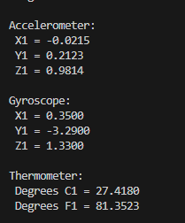

# The NRF52 IMU

Now that we've got the IMU working in Arudino, replicate that same example in platformIO.

## Steps

* Adding library reference in the [platformio.ini](./nrf52/platformio.ini)
  * 
* Run `pio run --target upload` to upload code to the Seeed board.
* And open the serial monitor in Visual Studio Code,
  * Ensuring the baud rate matches.
  * Success!!!

Still need work in calibrating sensor and potentially normalizing the sensor values. Further work.

## Resources

* Forum Post - https://forum.seeedstudio.com/t/seeed-xiao-ble-nrf52840-sense-giving-bad-gyroscope-data/274134
* SparkFun Documentation - https://learn.sparkfun.com/tutorials/lsm6ds3-breakout-hookup-guide/all#installing-the-arduino-library
* Sparkfun Github Repo - https://github.com/sparkfun/SparkFun_LSM6DS3_Arduino_Library