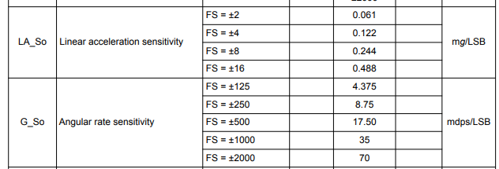

# nRF52 Sense IMU Settings

After getting the board printing in example 13, today trying to ensure that I can change the settings of the IMU.

## My Initial Thoughts 

_left for posterity sake_

* Need to ensure the IMU is being configured correctly, and that I'm using the appropriate constants to normalize the values
  * The [SensorSettings](https://github.com/Seeed-Studio/Seeed_Arduino_LSM6DS3/blob/master/LSM6DS3.h#L91) class contains all the values for this library.
* Then [this post answer](https://forum.seeedstudio.com/t/seeed-xiao-ble-nrf52840-sense-giving-bad-gyroscope-data/274134/4) details how to normalize the values given how the gyro/accelerometer was setup.
  * Values pulled from the datasheet

* Run and compile with `pio run --target upload`

## What Is Actually Happening

* Turns out there are 2 different methods to read sensor data:
  * `readRawAccelX` - reads raw sensor data
  * `readFloatAccelX` - normalizes sensor output based on settings
    * 2 methods for every axis and sensor type (accelerometer/gyro)
  * Since I'm already using the `readFloat` methods I don't have to normalize my values.
* I think I was just having issues with the gyroscope, which I think I need to calibrate that correctly.

## Resources

* [Seeed Forum #1](https://forum.seeedstudio.com/t/xiao-nrf52840-sense-free-falls-sleep-double-tap-wake-up-demo/272176)
* [Seeed Forum #2](https://forum.seeedstudio.com/t/seeed-xiao-ble-nrf52840-sense-giving-bad-gyroscope-data/274134)
* [Seeed LSM6DS3 Library](https://github.com/Seeed-Studio/Seeed_Arduino_LSM6DS3)