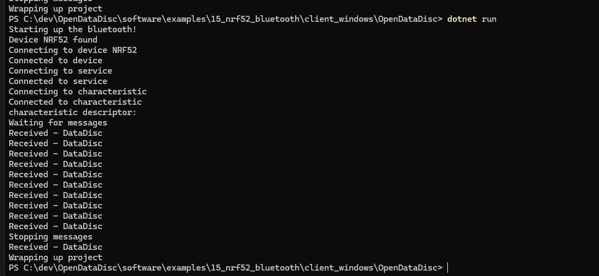

# nRF52 with Bluetooth Example

After getting the accelerometer working in example 14, moving on to getting bluetooth working with the nrf52 Sense.

## Work

* Pulling in windows client from example 7
* Pulling in nrf52 code from resources below
* As always, run and upload with `pio run --target upload`
* For the csharp client, use `dotnet build` and `dotnet run` to run it once the nrf52 is running.
  * After running, select the "NRF52" in the popup to proceed.
  * You'll see the following messages:

## Issues

* If you put `while (!Serial);` in your `main.cpp` (or Arduino sketch), the program will not run until a Serial monitor is open.
  * Maybe good for debugging, but took me awhile to figure out why it was only connecting with the serial monitor open.
* Takes a while to connect (15-20 seconds) once the NRF52 has been identified.
* Takes a while (20-30 seconds) for the Xiao Sense to receive disconnect messages.

## Resources

* [Seeed Wiki](https://wiki.seeedstudio.com/XIAO-BLE-Sense-Bluetooth-Usage/) says to use this library
  * https://github.com/arduino-libraries/ArduinoBLE
  * But also read this library doesn't work for the nrf52.
* Other links
  * https://forum.seeedstudio.com/t/xiao-seeed-nrf52840-sense-sending-accelerometer-data-through-ble-not-working/275391/2
  * https://forum.arduino.cc/t/arduinoble-notify-issue-with-blecharacteristic/1062011/5
  * https://github.com/arduino-libraries/ArduinoBLE/pull/5