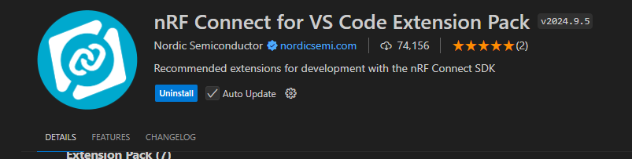

# Using NRF Connect

Up till now I've been using the Arduino based libraries. Both through Arduino IDE and PlatformIO.

My first measurement showed that I can get roughly 50 bluetooth msg/sec delivered from my nrf52 to my computer. That is not high enough for what I'm looking to measure.

So I'm now looking about using Nordic Semiconductor's (the maker of NRF 52840) proper SDK.

## Installation

> I'm currently using windows 11 device

* I followed this video:
  * https://www.youtube.com/watch?v=EAJdOqsL9m8
  * Downloaded the command line tools: https://www.nordicsemi.com/Products/Development-tools/nRF-Command-Line-Tools/Download
    * That included the SEEGER debugging tools
  * Dowload the nRF Connection for VS Code Extensions:
  
    * Install the tool chain (I downloaded 2.7.0)
    * Install SDK (through "Manage SDKs" option)
  * Everything installed as expected.
    * I'm on v2.7.0 for toolchain and SDK
* Onto this video: https://www.youtube.com/watch?v=T4RfflybIGE
* Now onto this video:
  * https://www.youtube.com/watch?v=N1kDSMBtQ2U
  * I selected the blinky pwm project
  * I selected the XIAO BLE Sense board
  * Then I build on my local machine
* Uploading to device
  * Following this video: https://www.youtube.com/watch?v=CPi44L0uzmo&t=631s
  * Go to `build/zephyr` folder in our project: `OpenDataDisc\software\examples\20_nrfconnect\blinky_pwm\build\zephyr`
  * Copy the `zephyr.uf2` file.
  * Click the reset button twice on the xiao sense to enter bootloader mode
  * On windows a new file explorer opened with my xiao sense
  * Copy the `zephyr.uf2` file into my sense
    * Works even with a `Current.uf2` file on the board.