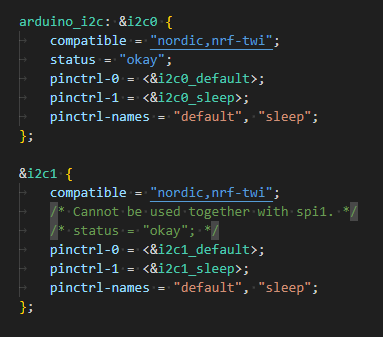

# Zephyr IMU

My Xiao Sense has a LSM6DS3 IMU built into it.

Previously I was using projectIO to interface with my board. Now that I've moved over to Zephyr, it does not have builtin support for the LSM6DS3.

So I'm attempting to write some code to allow me to pull data from my IMU.

LSM6DS3 Data Sheet - https://content.arduino.cc/assets/st_imu_lsm6ds3_datasheet.pdf

## Issues

* fatal error: device.h: No such file or directory
  * Changing my import from `#include <device.h>` to `#include <zephyr/device.h>` fixed it for me.
  * Apparently Zephyr changed how their files were referenced lately: https://stackoverflow.com/a/75943320/1352766
* 'i2c0' undeclared here (not in a function)
  * This was received when trying to define the i2c node: `#define I2C_NODE        DT_NODELABEL(i2c0)`
  * Referencing the device tree:

  * `i2c0` didn't seem to be the proper name of that i2c node. I could use either `arduino_i2c` or `i2c1`.
  * Moving to `arduino_i2c` resulted in a successful build for me locally.
