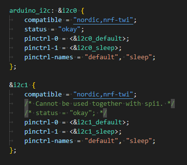
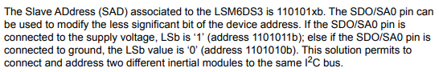
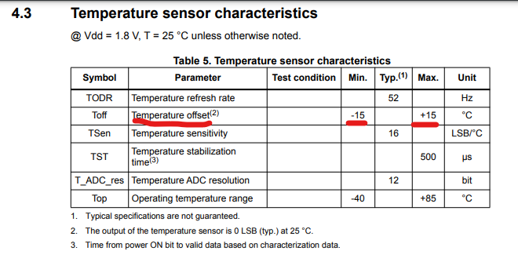

# Zephyr Temperature Sensor Tests

My Xiao Sense has a LSM6DS3 IMU built into it.

Previously I was using projectIO to interface with my board. Now that I've moved over to Zephyr, it does not have builtin support for the LSM6DS3.

So I'm attempting to write some code to allow me to pull data from my IMU. I'm going to start with reading from the temperature sensor on the IMU.

LSM6DS3 Data Sheet - https://content.arduino.cc/assets/st_imu_lsm6ds3_datasheet.pdf

While I eventually want to use my Xiao Sense with the IMU, right now I am using the nrf52840-dev-kit for this example.

## Wiring Up My Sensor

I'm using the default i2c nodes on the dev board. For the nrf52840-dev-kit, using the device tree viewer that resulted in this configuration:

```javascript
	i2c0_default: i2c0_default {
		group1 {
			psels = <NRF_PSEL(TWIM_SDA, 0, 26)>,
				<NRF_PSEL(TWIM_SCL, 0, 27)>;
		};
	};
```

SDA = 26
SCL = 27
Then GND and 3v3 connections.

I'm also running ground to the SA0 pin, since the SA0 controls what address the device is reachable at.

## Issues

* fatal error: device.h: No such file or directory
  * Changing my import from `#include <device.h>` to `#include <zephyr/device.h>` fixed it for me.
  * Apparently Zephyr changed how their files were referenced lately: https://stackoverflow.com/a/75943320/1352766
* 'i2c0' undeclared here (not in a function)
  * This was received when trying to define the i2c node: `#define I2C_NODE        DT_NODELABEL(i2c0)`
  * Referencing the device tree:

  * `i2c0` didn't seem to be the proper name of that i2c node. I could use either `arduino_i2c` or `i2c1`.
  * Moving to `arduino_i2c` resulted in a successful build for me locally.
* `CONFIG_NEWLIB_LIBC_FLOAT_PRINTF was assigned the value y, but got the value n. Missing dependencies: NEWLIB_LIBC`
  * I removed this from my config file, never really dug into why it was given me an issue
* `i2c_write` fails with a -5 error
  * From this page: https://software-dl.ti.com/simplelink/esd/simplelink_cc13x2_26x2_sdk/5.20.00.52/exports/docs/drivers/doxygen/html/group___i2_c___s_t_a_t_u_s.html
  * -5 = I2C_STATUS_ADDR_NACK (I2C slave address not acknowledged.)
  * confirmed the SA0 pin is connected to ground to try to ensure the i2c device is at memory address 0x6A
  * I probably need to scan through all addresses to see if it shows up anywhere else.
  * Turns out it as at memory address 0x6B for some reason. I'll try to debug further.

* `read temperature: *float*`
  * Could not print a float out properly.
  * Set this in the `prj.conf` file:
    * `CONFIG_CBPRINTF_FP_SUPPORT=y`
    * It gave this warning though: `Build the cbprintf utility function with support for floating point format specifiers. Selecting this increases stack size requirements slightly, but increases code size significantly.`
  * So apparently enabling float printing has it's drawbacks
  * Since I'm in debug mode it's fine.
* The only temperature value it's printing is 77 F.
  * The IMU might be in test mode.
  * I needed to configure both my Gyro and Accelerometer settings.
  * I did this by writing something to both control registers
    * acc - LSM6DS3_ACC_GYRO_CTRL1_XL
    * gyro - LSM6DS3_ACC_GYRO_CTRL2_G
* Then after that, it started printing out values but was not calibrated.
  * So I had to measure the temperature, compare against an actual temperature gauge, and calculate how many degrees it was off.
  * Mine was off by 16 degrees.
  * The datasheet says the temperature offset would be about +-15 C, which mine is right inline with that.
