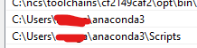

# Kalman Filter Tutorial

I've been utilizing Claude to try to understand how to implement a Kalman filter.

At the moment I've been unable to determine where my problems lie, and I don't know enough about the Kalman filter to actually understand what to change. So taking a step back and going to write something from scratch.

I'm following this book: https://github.com/rlabbe/Kalman-and-Bayesian-Filters-in-Python


## Lessons notebooks

### 01 GH Filter

This notebook introduces the problem that filters are trying to solve: __How to make sense of noisy data__.

They started with a thought experiment about scales with a large margin of error.

What if we have 2 measurements from this scale? How could we pick a reasonable value given these two noisy measurements? We'd probably pick a value in between those two measurements.

Then they introduced the idea of a measurement vs a prediction.

Again, they are just two data points much like the scales, but they key point __how can we blend the measurement and prediction to obtain a value__?

Then we introduced a g-h filter:
* g - determines whether we take more of the measurement or prediction
* h - controls how quickly we respond to changes from the measurement

And every step of the algorithm we:

* Predict the measurement(s)
* Update our values

### 02 Discrete Bayes

> The Kalman filter belongs to a family of filters called _Bayesian filters_.

#### Tracking a Dog

We create a device (sensor + microcontroller) to track where a dog is in a hallway.

How can we use this device to track the dog's position?

* prior - probability prior to incorporating measurements or other information
  * Also called prior probability distribution
* Frequentists v Bayesian statistics
  * Frequentist statistics is based on the idea that probabilities are fixed and objective.
    * Coin flip - probability of heads/tails is always 50/50. That probability never changes.
    * If I do X 100 times, what's the probability?
  * Bayesian statistics is based on the idea that probabilities change based on new information and embrace subjectivity.
    * sensors and filters
    * What's the probability of X happening right now/after I take this action?
* categorical distribution - a discrete distribution describing the probability of observing 
 outcomes
* multimodal distribution - multiple beliefs about the position of our dog.
* posterior - a probability distribution after incorporating the  measurement information.
  * Also called posterior probability distribution
* likelihood - how likely each position is given the measurement. Not a distribution since doesn't sum to one.

We can plot a categorical distribution with our belief about the dog's position. As the dog moves and we take more measurements, we can determine with more certainty where it is.

We are using meaurements to help us orient the dog inside the hallway.

What happens when we introduce noise into our sensor?

> When we talk about the filter's output we typically call the state after performing the prediction the prior or prediction, and we call the state after the update either the posterior or the estimated state.

* System - what we are trying to model or filter
  * Ex: System is dog
* State - it's current configuration or value
  * Ex: State is the dog's position
  * We rarely know the actual state, so we say our filters produce the _estimated state_.
* state or system evolution - One cycle of prediction and updating with a measurement.
  * For filters, time is usually a discrete step, such as 1 second
  * For our dog tracker, the system is the position of the dog, and the state evolution is the position after a discrete amount of time has passed.
* Process model - how we model our system behavior
  * The dog moving one or more positions at each time step.
* System error or process error - the error in the model
* The prediction is our new prior

#### Adding Uncertainty to the Prediction

All sensors have noise, so we can't be certain where our dog is. How can we incorporate uncertainty in our system.

We have to incorporate the probability related to sensor noise into our prediction.

If we're unsure of our position and we have noisy sensors, every prediction we take we lose accuracy/information. Since uncertain probabilities compound over time. If we approach to infinity the probability becomes even among the possible states.

#### Convolution

We want to generalize our code so it will work for all cases.

We solve this with convolution. Convolution modifies one function with another function. In our case, we are modifying a probability distribution with the error function of the sensor.

Kernel (which is an array) is slid across another array. This helps us calculate the probabilities at each time step.

#### Integrating Measurements and Movement Updates

How do we overcome the problem of losing information during a prediction? It's followed by an update step that incorporates the next measurement into it.

* predictor correctors - a type of algorithm that makes a prediction, then corrects it.
  * Kalman filter is a predictor corrector.


* What does the likelihood function do?
  * Computes how likely each position is given the measurement. 
  * It is not a probability distribution because it does not sum to one.

## Issues

I'll document any issues and find and my resolution to them.

### Cannot find ipywidgets.
```
ModuleNotFoundError                       Traceback (most recent call last)
<ipython-input-2-44ce08f6fafe> in <module>
      1 #format the book
----> 2 import book_format
      3 book_format.set_style()

C:\dev\Kalman-and-Bayesian-Filters-in-Python\book_format.py in <module>
     20 import sys
     21 import warnings
---> 22 from kf_book.book_plots import set_figsize, reset_figsize
     23 
     24 def test_installation():

C:\dev\Kalman-and-Bayesian-Filters-in-Python\kf_book\book_plots.py in <module>
     18 
     19 from contextlib import contextmanager
---> 20 import ipywidgets
     21 import matplotlib as mpl
     22 import matplotlib.pylab as pylab

ModuleNotFoundError: No module named 'ipywidgets'
```


Running `jupyter --version` gave me the following output:
```
PS C:\Users\morga> jupyter --version
jupyter core     : 4.6.3
jupyter-notebook : 6.0.3
qtconsole        : not installed
ipython          : 7.13.0
ipykernel        : 5.1.4
jupyter client   : 6.0.0
jupyter lab      : 2.0.1
nbconvert        : 5.6.1
ipywidgets       : not installed
nbformat         : 5.0.4
traitlets        : 4.3.3
```

https://ipywidgets.readthedocs.io/en/latest/user_install.html

Root issue: I changed to use the version of python that came with Anaconda versus what I had previously installed on my machine.

Resolution:

* Added the following items to my path variable:
  * `C:\Users\{username}\anaconda3`
  * `C:\Users\{username}\anaconda3\Scripts`
* place them higher than any current python references




Afterwards, I received the following when running `jupyter --version`:

```
PS C:\Users\morga> jupyter --version
Selected Jupyter core packages...
IPython          : 8.27.0
ipykernel        : 6.28.0
ipywidgets       : 8.1.5
jupyter_client   : 8.6.0
jupyter_core     : 5.7.2
jupyter_server   : 2.14.1
jupyterlab       : 4.2.5
nbclient         : 0.8.0
nbconvert        : 7.16.4
nbformat         : 5.10.4
notebook         : 7.2.2
qtconsole        : 5.5.1
traitlets        : 5.14.3
PS C:\Users\morga>
```

Stackoverflow answer: https://stackoverflow.com/a/62689395/1352766

### Cannot find filterpy

```
Please install FilterPy from the command line by running the command
	$ pip install filterpy

See chapter 0 for instructions.
UnboundLocalError                         Traceback (most recent call last)
Cell In[4], line 2
      1 #format the book
----> 2 import book_format
      3 book_format.set_style()

File C:\dev\Kalman-and-Bayesian-Filters-in-Python\book_format.py:80
     71         print('You must use Python version 3.6 or later for the notebooks to work correctly')
     74     # need to add test for IPython. I think I want to be at 6, which also implies
     75     # Python 3, matplotlib 2+, etc.
     76 
     77 # ensure that we have the correct packages loaded. This is
     78 # called when this module is imported at the top of each book
     79 # chapter so the reader can see that they need to update their environment.
---> 80 test_installation()
     83 # now that we've tested the existence of all packages go ahead and import
     85 import matplotlib

File C:\dev\Kalman-and-Bayesian-Filters-in-Python\book_format.py:52, in test_installation()
     48     print("Please install matplotlib before continuing. See chapter 0 for instructions.")
     50 from distutils.version import LooseVersion
---> 52 v = filterpy.__version__
     53 min_version = "1.4.4"
     54 if LooseVersion(v) < LooseVersion(min_version):

UnboundLocalError: cannot access local variable 'filterpy' where it is not associated with a value
```

I've installed it via pip, trying to see if I need to install it via conda.

I ran `conda install filterpy` to install it and it seemed to work.

After installing conda, it seems like I have two versions of python. So I got to make sure everything is installed on the right location.

### Plots Not Displaying due to Jupyter Not Trusting Notebook

For a while I couldn't get the plots displaying.

I had to run the following for each notebook:

`jupyter trust .\01-g-h-filter.ipynb`

That allowed Jupyter to trust each notebook and allowed them to display the plots.