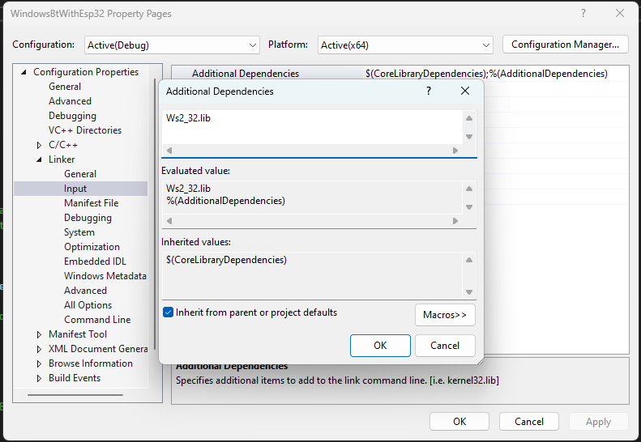
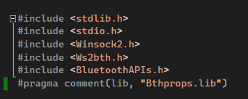
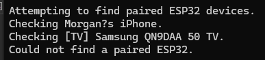

# Bluetooth 01 Project

I'm trying to get bluetooth working between my Computer and my ESP32 microcontroller.

I'm following [this tutorial](https://github.com/finallyfunctional/bluetooth-windows-esp32-example), and I had to make the following changes to get it building and running on my machine:

## Download C++ Tools for Visual Studio 2022

When I first loaded the project, I needed to install the C++ development tools. That was easy.

## Wasn't Linking Ws2_32.lib

Then I built the project, and encountered the following errors:

```
Build started...
1>------ Build started: Project: WindowsBtWithEsp32, Configuration: Debug x64 ------
1>WindowsBtWithEsp32.cpp
1>WindowsBtWithEsp32.obj : error LNK2019: unresolved external symbol __imp_closesocket referenced in function "bool __cdecl sendMessageToEsp32(void)" (?sendMessageToEsp32@@YA_NXZ)
1>WindowsBtWithEsp32.obj : error LNK2019: unresolved external symbol __imp_connect referenced in function "bool __cdecl connectToEsp32(void)" (?connectToEsp32@@YA_NXZ)
1>WindowsBtWithEsp32.obj : error LNK2019: unresolved external symbol __imp_ioctlsocket referenced in function "bool __cdecl connectToEsp32(void)" (?connectToEsp32@@YA_NXZ)
1>WindowsBtWithEsp32.obj : error LNK2019: unresolved external symbol __imp_recv referenced in function "bool __cdecl recieveMessageFromEsp32(void)" (?recieveMessageFromEsp32@@YA_NXZ)
1>WindowsBtWithEsp32.obj : error LNK2019: unresolved external symbol __imp_send referenced in function "bool __cdecl sendMessageToEsp32(void)" (?sendMessageToEsp32@@YA_NXZ)
1>WindowsBtWithEsp32.obj : error LNK2019: unresolved external symbol __imp_socket referenced in function "bool __cdecl connectToEsp32(void)" (?connectToEsp32@@YA_NXZ)
1>WindowsBtWithEsp32.obj : error LNK2019: unresolved external symbol __imp_WSAStartup referenced in function "bool __cdecl startupWindowsSocket(void)" (?startupWindowsSocket@@YA_NXZ)
1>WindowsBtWithEsp32.obj : error LNK2019: unresolved external symbol __imp_WSACleanup referenced in function "bool __cdecl sendMessageToEsp32(void)" (?sendMessageToEsp32@@YA_NXZ)
1>WindowsBtWithEsp32.obj : error LNK2019: unresolved external symbol __imp_WSAGetLastError referenced in function "bool __cdecl connectToEsp32(void)" (?connectToEsp32@@YA_NXZ)
1>WindowsBtWithEsp32.obj : error LNK2019: unresolved external symbol BluetoothFindFirstDevice referenced in function "bool __cdecl getPairedEsp32BtAddress(void)" (?getPairedEsp32BtAddress@@YA_NXZ)
1>WindowsBtWithEsp32.obj : error LNK2019: unresolved external symbol BluetoothFindNextDevice referenced in function "bool __cdecl getPairedEsp32BtAddress(void)" (?getPairedEsp32BtAddress@@YA_NXZ)
1>C:\dev\bluetooth-windows-esp32-example\WindowsBtWithEsp32\x64\Debug\WindowsBtWithEsp32.exe : fatal error LNK1120: 11 unresolved externals
1>C:\Program Files\Microsoft Visual Studio\2022\Community\MSBuild\Microsoft\VC\v170\Microsoft.CppCommon.targets(1127,5): error MSB6006: "link.exe" exited with code 1120.
1>Done building project "WindowsBtWithEsp32.vcxproj" -- FAILED.
========== Build: 0 succeeded, 1 failed, 0 up-to-date, 0 skipped ==========
========== Build started at 8:07 PM and took 03.596 seconds ==========
```

To fix this, I added `Ws2_32.lib` into my Additional Dependencies. As described in this [stack overflow](https://stackoverflow.com/a/53873194)

* Right click on my "WindowsBtWithEsp32" project in Solution Explorer
* Click Properties
* Go to Linker => Input. Click to edit Additional Dependencies
* Add `Ws2_32.lib` in the first box:


## Didn't Have Pragma comment

Then I built again, and received the following error:

```
Build started...
1>------ Build started: Project: WindowsBtWithEsp32, Configuration: Debug x64 ------
1>WindowsBtWithEsp32.obj : error LNK2019: unresolved external symbol BluetoothFindFirstDevice referenced in function "bool __cdecl getPairedEsp32BtAddress(void)" (?getPairedEsp32BtAddress@@YA_NXZ)
1>WindowsBtWithEsp32.obj : error LNK2019: unresolved external symbol BluetoothFindNextDevice referenced in function "bool __cdecl getPairedEsp32BtAddress(void)" (?getPairedEsp32BtAddress@@YA_NXZ)
1>C:\dev\bluetooth-windows-esp32-example\WindowsBtWithEsp32\x64\Debug\WindowsBtWithEsp32.exe : fatal error LNK1120: 2 unresolved externals
1>Done building project "WindowsBtWithEsp32.vcxproj" -- FAILED.
========== Build: 0 succeeded, 1 failed, 0 up-to-date, 0 skipped ==========
========== Build started at 8:12 PM and took 00.453 seconds ==========
```

To fix this I added this comment (`#pragma comment(lib, "Bthprops.lib")`) below my include statements



Then I could build and run the solution:



## Forked Repo with Fixes In It

I'm thankful to [finally functional](https://github.com/finallyfunctional) for code on how to get started. I've forked his repo and included the 2 fixes I mentioned above in my fork. Hopefully this gives people enough info to avoid these same issues locally.

* Original Repo: https://github.com/finallyfunctional/bluetooth-windows-esp32-example
* Forked Repo: https://github.com/morgankenyon/bluetooth-windows-esp32-example