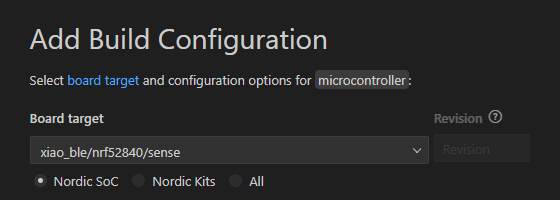

# Microcontroller

This project uses a [XIAO nRF52840 Sense](https://www.seeedstudio.com/Seeed-XIAO-BLE-Sense-nRF52840-p-5253.html) as the brains.

It's main purpose is to establish a bluetooth connection between itself and the client, then send over accelerometer and gyro sensor readings.

## Local Project Setup

* Install nRF Connect locally
  * Here is a YouTube playlist demonstrating how to do that.
  * https://www.youtube.com/watch?v=EAJdOqsL9m8&list=PLx_tBuQ_KSqEt7NK-H7Lu78lT2OijwIMl
  * I installed the latest versoin at the time (v2.7.0)
* Create build folder
  * By default, the `/build` folder of an nRF Connect project is not checked into git.
    * This is the default right now, not sure if it should change?
  * Using the nRF Connect Plugin, add a new build configuration, target the proper board.
  * nRF 52840 Dev Kit:
  
    * I used this board during early development
  * XIAO nRF52840 Sense:
  
  * Just accept the defaults for everything else.
* Build and flash using the plugin
  * Using the nRF Connect Plugin, build and flash the application.
  * You can use the "Connected Devices" area to view the serial monitor if needed.

## Issues and TODOs

None at the moment